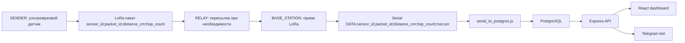

# HydroPulse

HydroPulse — система мониторинга уровня воды для гидропостов. Проект связывает Arduino/LoRa-узлы, PostgreSQL, Express API, React-интерфейс и Telegram-бота. Датчики отправляют расстояние до воды, backend пересчитывает его в уровень воды, сохраняет историю, создает тревоги и строит краткосрочный прогноз паводкового риска.

## Что Реализовано

- Arduino/LoRa-контур: датчик, ретранслятор и базовая станция.
- Импорт аппаратных данных из COM-порта в PostgreSQL.
- Express API для дашборда, карты, графиков, прогноза, тревог и админки.
- PostgreSQL-схема с гидропостами, датчиками, измерениями и тревогами.
- React-приложение с главной страницей, картой, графиками, прогнозом и CRUD-админкой.
- Telegram-бот с командами `/status`, `/alerts`, `/stations`, `/post`, `/id`, `/help`.
- Тестовый ввод замеров без Arduino через web-форму и API.

## Структура Проекта

```text
apps/api
  server.js                 основной Express API
  db.js                     подключение и диагностика PostgreSQL
  serial_to_postgres.js     импорт строк DATA из COM-порта
  telegramBot.js            команды Telegram-бота
  notificationService.js    фоновые Telegram-уведомления о тревогах

apps/web
  src/api                   клиентские функции обращения к backend API
  src/pages                 страницы: главная, карта, графики, прогноз, админка, вход
  src/components            таблицы, карта, графики, виджеты, формы
  src/context               тема и авторизация

arduino_code/FULL
  SENDER                    узел-датчик: ультразвук + LoRa
  RELAY                     ретранслятор LoRa
  BASE_STATION              приемник LoRa, печатает DATA-строки в Serial

database
  ALL_TABLES.sql            схема БД и демо-данные
  *.backup                  резервные копии PostgreSQL
```

Папка `arduino_code/trash` содержит старые эксперименты и тестовые скетчи. Рабочий контур находится в `arduino_code/FULL`.

## Поток Данных



Если Arduino пока нет, замер можно добавить через React-форму или `POST /api/measurements`. Он пройдет через ту же backend-логику: расчет уровня воды, сохранение, проверка порогов, создание тревоги.

## База Данных

Основные таблицы:

- `water_bodies` — справочник водных объектов.
- `settlements` — населенные пункты рядом с гидропостами.
- `monitoring_stations` — гидропосты, координаты, опасный/критический пороги, высота и угол датчика.
- `sensors` — физические датчики, привязанные к гидропостам.
- `water_level_measurements` — история замеров: расстояние, рассчитанный уровень воды, RSSI/SNR, время.
- `alerts` — тревоги `danger` и `critical`, закрываются через `resolved_at`.
- `users` — создается backend-ом при старте для входа в админку.

Расчет уровня воды:

```text
water_level_cm = sensor_height_cm - distance_cm * cos(sensor_angle_deg)
```

Если высота датчика не задана, backend считает уровень равным измеренному расстоянию. В рабочей схеме высота есть у каждого гидропоста.

## Запуск PostgreSQL

Создай базу `HydroPulse`, затем выполни:

```powershell
psql -U postgres -d HydroPulse -f database/ALL_TABLES.sql
```

Через pgAdmin можно открыть `database/ALL_TABLES.sql` в Query Tool и выполнить весь файл.

## Backend

Файл настроек: `apps/api/.env`.

Минимальный набор:

```env
PORT=3001
AUTH_SECRET=change_me_for_production
DATABASE_HOST=localhost
DATABASE_PORT=5432
DATABASE_NAME=HydroPulse
DATABASE_USER=postgres
DATABASE_PASSWORD=postgres
DEFAULT_ADMIN_USERNAME=admin
DEFAULT_ADMIN_PASSWORD=admin123
DEFAULT_VIEWER_USERNAME=viewer
DEFAULT_VIEWER_PASSWORD=viewer123
SERIAL_PORT=COM8
SERIAL_BAUD_RATE=9600
NOTIFICATIONS_ENABLED=true
NOTIFICATION_TIMEOUT_MS=10000
TELEGRAM_BOT_TOKEN=токен_бота
TELEGRAM_CHAT_ID=chat_id
TELEGRAM_BOT_POLLING=true
TELEGRAM_ALLOWED_CHAT_IDS=
```

Запуск API:

```powershell
cd apps/api
npm.cmd install
npm.cmd run dev
```

Проверка:

```text
http://localhost:3001/api/health
```

Импорт данных из COM-порта:

```powershell
cd apps/api
npm.cmd run serial
```

## Frontend

Файл настроек: `apps/web/.env`.

```env
REACT_APP_API_URL=http://localhost:3001
```

Карта в текущем коде работает через Leaflet/OpenStreetMap.

Запуск:

```powershell
cd apps/web
npm.cmd install
npm.cmd start
```

Сайт:

```text
http://localhost:3000
```

## Arduino / LoRa

Рабочий комплект:

- `SENDER` измеряет расстояние ультразвуковым датчиком, фильтрует серию измерений и отправляет пакет.
- `RELAY` принимает пакет, проверяет дубликат, увеличивает `hop_count` и пересылает дальше.
- `BASE_STATION` принимает пакет, добавляет `rssi` и `snr`, печатает строку для Node.js.

Формат LoRa-пакета:

```text
sensor_id;packet_id;distance_cm;hop_count
```

Формат строки для backend:

```text
DATA;sensor_id;packet_id;distance_cm;hop_count;rssi;snr
```

Пример:

```text
DATA;001;15;230.5;1;-72;8.4
```

## API

Публичные ручки:

```text
GET  /api/health
GET  /api/monitoring_stations/latest
GET  /api/monitoring_stations
GET  /api/water_level_measurements/:sensor_id?hours=24
GET  /api/water_level_measurements/:sensor_id?limit=30
GET  /api/sensors
GET  /api/alerts?limit=20
GET  /api/forecast/:sensor_id?model_limit=120&history_limit=24&horizon_hours=12
POST /api/measurements
```

Авторизация и админка:

```text
POST   /api/auth/login
GET    /api/auth/me
POST   /api/admin/measurements
POST   /api/demo/measurements
GET    /api/db/tables
GET    /api/db/:table
POST   /api/db/:table
PUT    /api/db/:table/:id
DELETE /api/db/:table/:id
POST   /api/admin/monitoring_stations_with_sensor
```

Пример ручного замера:

```json
{
  "sensor_id": "001",
  "packet_id": 16,
  "distance_cm": 230,
  "hop_count": 1,
  "rssi": -72,
  "snr": 8
}
```

## Telegram-Бот

Бот запускается вместе с `server.js`, если задан `TELEGRAM_BOT_TOKEN`.

Команды:

```text
/status    состояние системы
/alerts    активные тревоги
/stations  список гидропостов
/post 001  гидропост по sensor_id, коду или названию
/id        показать chat_id
/help      список команд
```

Если `TELEGRAM_ALLOWED_CHAT_IDS` пустой, команды доступны всем, кто пишет боту. Если в переменной перечислить ID через запятую, бот будет отвечать только этим чатам.

## Где Смотреть Код

- Расчет уровня воды: `apps/api/server.js`, `calculate_water_level`.
- Создание тревог: `apps/api/server.js`, `create_alert_if_needed`.
- Прогноз: `apps/api/server.js`, `build_forecast_response`.
- COM-импорт: `apps/api/serial_to_postgres.js`.
- Telegram-команды: `apps/api/telegramBot.js`.
- Прогнозный график: `apps/web/src/components/forecast/ForecastChart.jsx`.
- Карта: `apps/web/src/components/map/GMap.jsx`.
- Arduino-пакеты: `arduino_code/FULL`.
